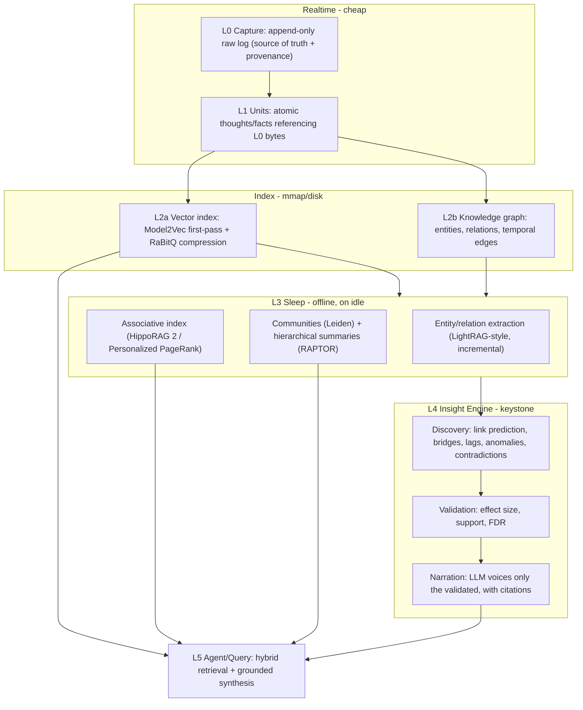
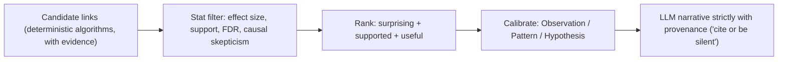
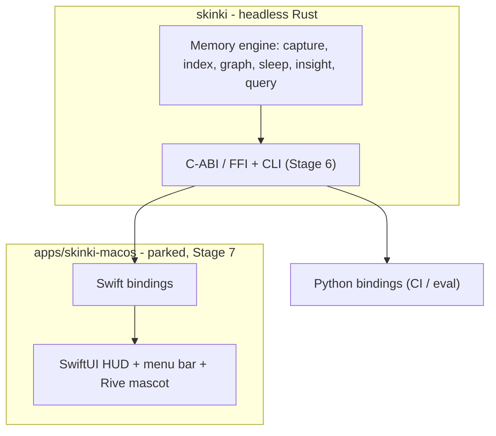

# skinki Exocortex — Architecture

This document describes the architecture of the **Exocortex**: a portable,
local-first memory and insight engine. The primary artifact is a headless Rust
crate (`skinki`); the macOS app ([`apps/skinki-macos/`](apps/skinki-macos/)) is
a secondary consumer wrapper whose own architecture is documented
[there](apps/skinki-macos/ARCHITECTURE.md).

- **Audience:** contributors.
- **Status:** living document. Stage 0 (the eval harness) is implemented; later
  layers are built and benchmarked stage by stage per the [roadmap](ROADMAP.md).

## Guiding constraints

- **Intelligence in the memory, not the model.** A ~4B model on an M1 Air; the
  substrate (index, graph, consolidation, context assembly) carries the weight.
- **Benchmark before invention.** Compress the best existing building blocks
  against hard budgets first; invent a format/algorithm only where they break.
- **Realtime capture is cheap; thinking is deferred.** Capture is an instant
  append. All heavy processing happens during "sleep" (idle + on power),
  interruptibly and incrementally — never blocking realtime or draining battery.
- **Local and private.** Zero network bytes. Provenance is preserved end-to-end
  so every surfaced claim is traceable to source bytes.

## Layered overview

The engine is a stack of layers, from a cheap append-only capture log up to a
grounded insight/query layer. Heavy transforms are quarantined in the offline
"sleep" layer.

### Layer responsibilities

- **L0 Capture / L1 Units** — an append-only raw log (the source of truth) and
  the atomic memory units extracted from it, each pointing back to L0 byte
  ranges for provenance.
- **L2 Index** — a compressed vector index (cheap static first-pass, then a
  compressed precise rerank) plus a knowledge graph of entities/relations with
  temporal edges, all mmap-backed so RAM stays bounded.
- **L3 Sleep** — offline consolidation: incremental extraction, community
  detection, hierarchical summarization, and the associative (PPR) index. Runs
  only when idle and on power, interruptible and resumable.
- **L4 Insight Engine** — the keystone, designed to be non-hallucinating by
  *separating discovery from narration* (see below).
- **L5 Agent/Query** — hybrid vector + graph retrieval feeding a **context
  assembler**: a budgeted, structured package (cited facts with dates,
  pre-joined multi-hop chains, community summaries, flagged contradictions)
  rather than top-k chunks — on an M1 Air prefill speed makes every context
  token expensive, so the substrate does the joins and the small model only
  verbalizes. This is the surface the app and bindings talk to.

## Insight Engine without hallucinations

Discovery is deterministic and evidence-bearing; statistical validation gates
what survives; only then does an LLM narrate — and only with provenance. If it
can't cite, it stays silent.

## Engine ↔ app boundary

The engine is the portable artifact ("FFmpeg for personal knowledge"): headless,
embeddable, with a stable C-ABI/FFI and CLI (Stage 6). The macOS app consumes it
through Swift bindings at Stage 7. A Python binding drives CI and evaluation.

## How the code maps to the layers (current)

| Layer | Where it lives today |
| --- | --- |
| Eval harness (cross-cutting) | [`crates/skinki-eval`](crates/skinki-eval), [`skinki-telemetry`](crates/skinki-telemetry) |
| Synthetic corpus + ground truth | [`crates/skinki-corpus`](crates/skinki-corpus) |
| Baseline retriever (L2a proxy) | [`crates/skinki-baseline`](crates/skinki-baseline) |
| CLI / orchestration | [`crates/skinki-harness`](crates/skinki-harness) |
| L1-L5 engine | built stage by stage (see [`ROADMAP.md`](ROADMAP.md)) |
| Consumer wrapper | [`apps/skinki-macos`](apps/skinki-macos) (parked, Stage 7) |

## Why these choices (trade-offs)

- **Rust core over a Swift-only app:** portability (embeddable anywhere),
  predictable memory, and `no_std`-friendly hot paths — at the cost of an FFI
  boundary, which we pay deliberately so the engine outlives any one UI.
- **Synthetic eval first:** real journals aren't labeled; planted ground truth
  is the only way to honestly measure recall vs multi-hop vs insight before
  building the expensive layers.
- **Sleep-time consolidation:** keeps realtime capture instant and the battery
  budget intact by deferring all heavy graph/summary work to idle-on-power.

## Related documents

- [`ROADMAP.md`](ROADMAP.md) — staged, hypothesis-driven plan with decision gates.
- [`README.md`](README.md) — the engine and the Stage 0 harness.
- [`apps/skinki-macos/ARCHITECTURE.md`](apps/skinki-macos/ARCHITECTURE.md) — the macOS wrapper (Stage 7).
