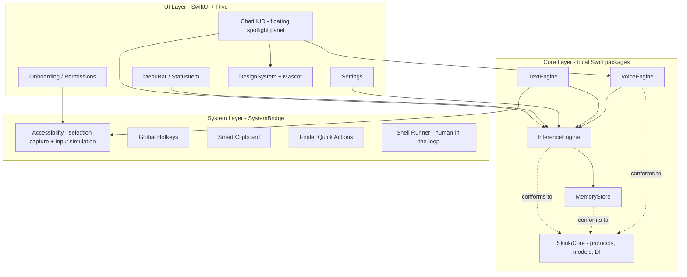
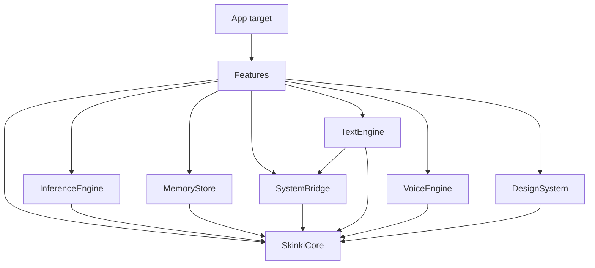
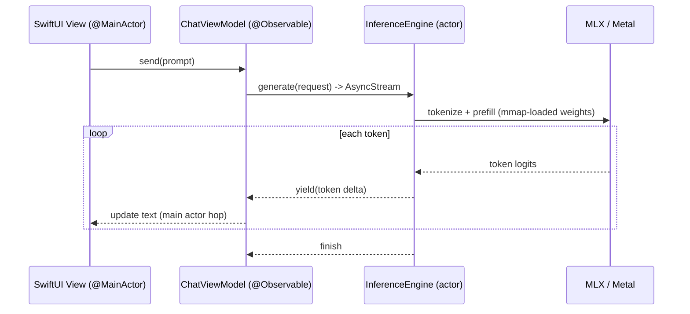
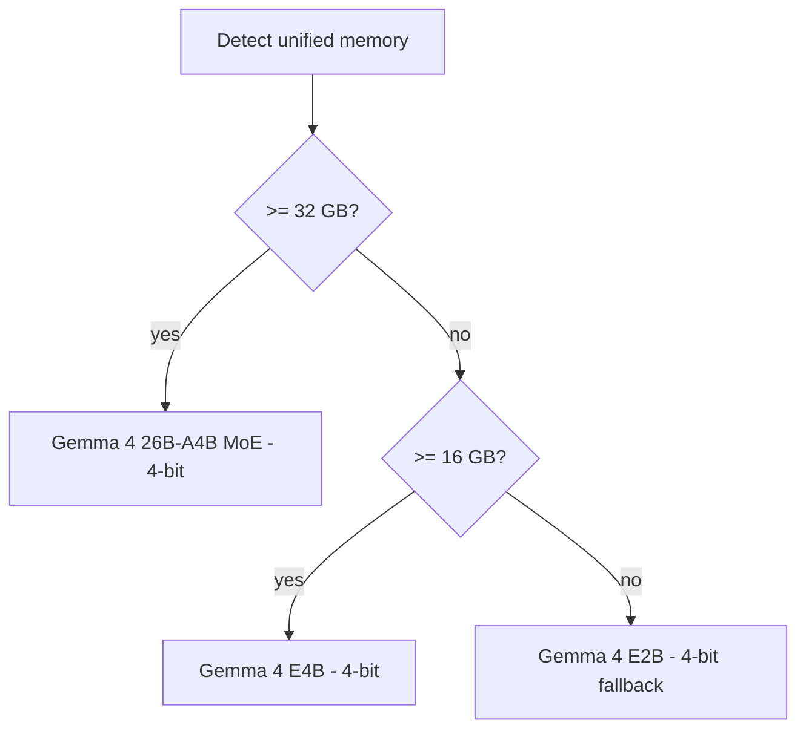
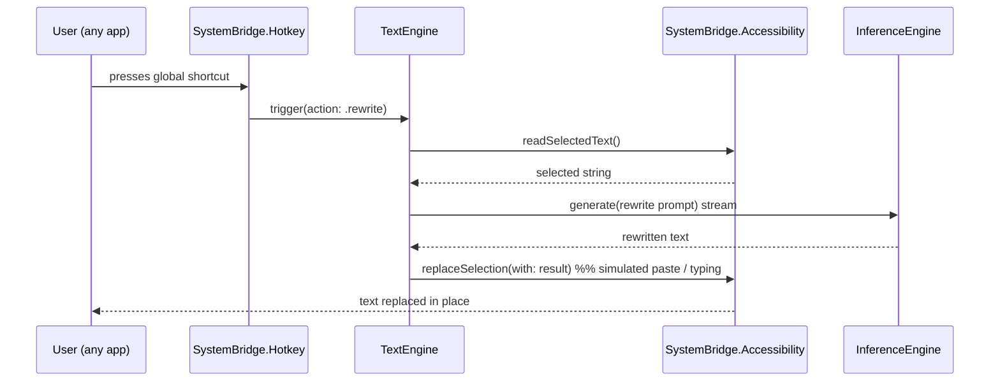

# Skinki — Architecture

This document describes the high-level architecture of Skinki: how SwiftUI (UI + animations), Apple MLX (Gemma 4 inference), and low-level macOS system APIs are composed into a single, fast, native, non-blocking application.

- **Audience:** contributors.
- **Status:** living document. The foundation stage establishes these boundaries; implementation fills them in per the [roadmap](ROADMAP.md).

---

## 1. Guiding constraints

These constraints shape every decision below.

- **Single native binary.** No Python sidecar. Inference runs in-process via `mlx-swift-lm`. This gives the best cold-start, lowest memory overhead, and a clean consumer `.dmg`.
- **Non-sandboxed, Developer-ID signed, notarized.** Deep integration (Accessibility, input simulation, shell, Full Disk Access) is incompatible with the App Store sandbox. Skinki ships outside the App Store as a notarized `.dmg`.
- **Apple Silicon, macOS 15+.** MLX requires Apple Silicon; macOS 15 gives us the latest SwiftUI, `ScreenCaptureKit`, and Speech APIs.
- **The UI thread is sacred.** Inference, embeddings, disk, and system calls never block the main actor. Everything heavy lives behind `actor`s and `async` streams.
- **Resource humility (Pillar 3).** The model is loaded lazily via `mmap`, kept warm only while in use, and aggressively unloaded on idle.

## 2. Layered overview

Skinki is split into three layers connected by protocols defined in `SkinkiCore`, so the UI depends on abstractions, not on fragile system APIs or the inference backend.



### Layer responsibilities

- **UI Layer** — SwiftUI views, windows (menu-bar `NSStatusItem`, a borderless floating `NSPanel` for the HUD), onboarding, settings, and the `DesignSystem` (tokens + the Rive mascot). Holds no business logic; talks to the core through injected protocol types.
- **Core Layer** — the brains. Inference, memory/RAG, text transformations, voice. Each is a local Swift package exposing a small protocol-driven API.
- **System Layer (`SystemBridge`)** — the only place allowed to touch fragile/low-level macOS APIs (Accessibility `AX*`, `CGEvent` input simulation, Carbon hotkeys, pasteboard, `ScreenCaptureKit`, shell). Everything else depends on its protocols, so risky code is quarantined and testable.

## 3. Module map (local Swift packages)

The codebase is split into independent local SPM packages under `Packages/`. Tuist generates the Xcode workspace and the thin app target; functionality and third-party dependencies live in the packages.



| Package | Responsibility | Key external deps |
| --- | --- | --- |
| `SkinkiCore` | Domain models, cross-cutting protocols (`LLMService`, `EmbeddingService`, `SpeechSynthesizing`, `MemoryStoring`), DI container, config, logging. The dependency sink that breaks cycles. | — |
| `InferenceEngine` | Loads/unloads Gemma 4, streams tokens, detects hardware tier, owns the `ModelContainer`. Implements `LLMService` + `EmbeddingService`. | `mlx-swift-lm` (`MLXLLM`, `MLXLMCommon`, `MLXEmbedders`), `swift-transformers`, `swift-huggingface` |
| `MemoryStore` | Long-term memory & RAG over SQLite + `sqlite-vec`. Implements `MemoryStoring`. | `SQLiteVec` |
| `SystemBridge` | Accessibility selection capture, `CGEvent` input simulation, global hotkeys, smart clipboard, shell runner, screen capture (later). | — (system frameworks) |
| `TextEngine` | Rewrite / translate / summarize pipelines and prompt templates operating on captured text. | — |
| `VoiceEngine` | Speech-to-text (native dictation) + `SpeechSynthesizing` (`AVSpeechSynthesizer` now, neural later). | — |
| `DesignSystem` | Design tokens (color, blur, motion timings, haptics), reusable joy components, the `MascotView` Rive controller. | `RiveRuntime` |
| `Features` | Composition layer: `ChatHUD`, `MenuBarUI`, `Onboarding`, `Settings`. Wires core packages into SwiftUI. | (all of the above) |

## 4. The SwiftUI ↔ MLX ↔ macOS bridge

The central concern: connect SwiftUI, MLX inference, and system calls elegantly **without ever blocking the UI**.

### 4.1 Inference as an actor with streaming

`InferenceEngine` is an `actor` that owns the MLX `ModelContainer`. Generation is exposed as an `AsyncStream<String>` of token deltas. SwiftUI views consume the stream with `for await` and append to an `@Observable` view model — natural backpressure, no callbacks, no locks.

```swift
public protocol LLMService: Sendable {
    func ensureLoaded(tier: ModelTier) async throws
    func generate(_ request: GenerationRequest) -> AsyncThrowingStream<String, Error>
    func unload() async
}
```



### 4.2 Hardware tiering

On first run (and when memory pressure changes), `InferenceEngine` picks a model tier from unified memory size, with a manual override in Settings.



### 4.3 Memory humility lifecycle (Pillar 3)

- **Cold start:** weights are memory-mapped (`mmap`), so time-to-first-token stays low without reading the whole file up front.
- **Warm:** the `ModelContainer` is retained while a session is active.
- **Idle:** an idle timer (e.g. 90s with no activity) triggers `unload()`, releasing weights back to the OS. The next request transparently reloads.
- **Pressure:** subscribe to `DISPATCH_SOURCE_TYPE_MEMORYPRESSURE` to unload eagerly under system pressure.

### 4.4 System calls behind a bridge

The UI and core never import Accessibility or Carbon directly. `SystemBridge` exposes async, `Sendable` protocols (e.g. `SelectionReading`, `InputSimulating`, `HotkeyRegistering`). This isolates the riskiest, most permission-sensitive, and OS-version-fragile code, and makes it mockable in tests.



## 5. Concurrency & threading model

- **`@MainActor`** — all SwiftUI views and view models that drive UI.
- **`actor InferenceEngine`** — serializes access to the (non-`Sendable`) MLX model; only one generation runs at a time.
- **`actor MemoryStore`** — serializes SQLite access.
- **Detached work** — embeddings and disk I/O run off the main actor and hand results back via `async` returns or streams.
- **Cancellation** — generation streams are cancellable; closing the HUD cancels the in-flight task.

## 6. Security & privacy posture

- 100% on-device. No network calls for inference; the only network use is the one-time model download (Hugging Face), shown transparently during onboarding.
- **Human-in-the-loop** for any destructive action: shell commands and file mutations require explicit confirmation in the UI, with a clear diff/preview. Destructive operations are gated behind a confirmation protocol in `SystemBridge`.
- Memory data is stored locally in `~/Library/Application Support/Skinki/` and is encryptable at rest (SQLCipher) — see [`docs/MEMORY.md`](docs/MEMORY.md).
- TCC permissions (Accessibility, Microphone, Speech Recognition, optionally Full Disk Access, Screen Recording) are requested contextually with friendly explanations, never up front in a wall.

## 7. Packaging & distribution

- Built and signed with a Developer ID certificate, **Hardened Runtime** enabled.
- Notarized and stapled, distributed as a `.dmg`.
- Models are downloaded on first launch (not bundled), keeping the `.dmg` small.

## 8. Why these choices (trade-offs)

- **`mlx-swift-lm` over a Python sidecar:** single binary, lower RAM, faster start, simpler packaging — at the cost of being tied to the Swift MLX API surface and its model coverage. Acceptable: it already supports Gemma 4 text + MoE and EmbeddingGemma.
- **Local SPM packages over a monolith:** enforced module boundaries, faster incremental builds, testability — at the cost of some manifest overhead.
- **Rive over Lottie/pure-Metal:** a reactive, state-machine mascot that responds to events (thinking, typing, success, error) — the "living" feel — without the cost of hand-writing Metal.
- **Non-sandboxed:** required for the deep integration that is the whole point; mitigated by notarization and explicit, contextual permission prompts.

## 9. Related documents

- [`ROADMAP.md`](ROADMAP.md) — phased delivery plan.
- [`docs/MEMORY.md`](docs/MEMORY.md) — RAG and long-term memory.
- [`docs/DESIGN.md`](docs/DESIGN.md) — joy-design system and mascot.
