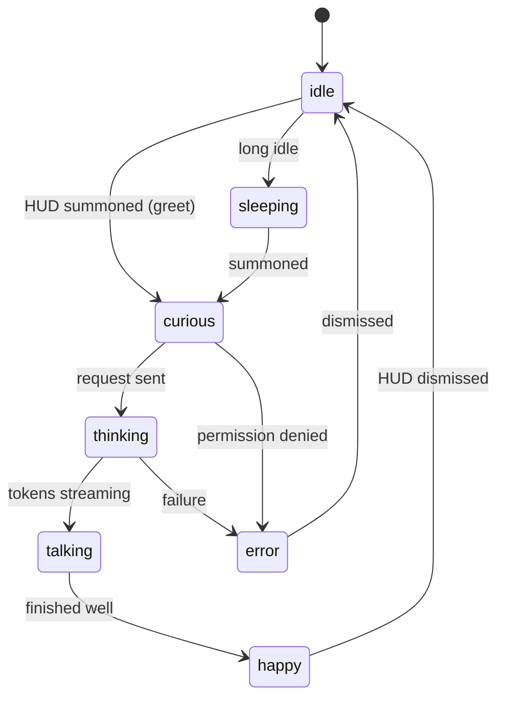

# Skinki — Design System & Joy-Design Principles

Skinki must feel *alive, native, and delightful*. This document defines the design philosophy, the token system, and the mascot — the soul of the product.

References for the feel we're chasing: Duolingo (playful, rewarding), Phantom Wallet (smooth, premium, confident), and Apple's own native polish (blur, depth, restraint).

---

## 1. Principles

1. **Native first, then magic.** Use real macOS materials (`NSVisualEffectView` blurs, vibrancy), system fonts, and the user's accent color. Skinki should look like it shipped with the OS — then add a layer of joy on top.
2. **Every interaction has a reaction.** No dead taps. Press, hover, success, and error each have motion, and often sound + the mascot responding. Feedback is immediate (< 100 ms) even if the answer is not.
3. **Motion with meaning.** Animation communicates state and causality, never decoration for its own sake. Spring physics over linear easing. Things move *from* and *to* somewhere.
4. **Joy, not noise.** Delight is earned and occasional — a celebratory wiggle on a great result, not confetti on every click. Respect focus.
5. **Zero friction.** No terminals, no jargon, no walls of permission prompts. The mascot guides; defaults are smart.
6. **Calm by default, expressive on demand.** At rest Skinki is quiet and out of the way (a small mascot in the menu bar). It comes alive when summoned.

## 2. Motion language

- **Springs everywhere.** Default interactive spring: response ≈ `0.35`, damping ≈ `0.8`. Playful accents (mascot reactions): lower damping for a bit of bounce.
- **Choreography.** Elements enter/exit in a sequence, not all at once. The HUD blurs in, then the input, then the mascot greets.
- **Continuity.** The HUD should feel like it grows from the hotkey/menu-bar origin, not appear from nowhere (matched-geometry / scale-from-origin).
- **Reduce Motion.** Always honor `accessibilityReduceMotion`: swap springs for quick fades, keep the product fully usable.

## 3. Token system

Tokens live in the `DesignSystem` package as the single source of truth. No hard-coded colors, sizes, or durations anywhere else.

### Color
- Semantic, not literal: `surface`, `surfaceElevated`, `accent`, `onAccent`, `textPrimary`, `textSecondary`, `success`, `warning`, `danger`.
- Driven by the system appearance (light/dark) and the user's accent color where appropriate.

### Materials & elevation
- Background blurs map to `NSVisualEffectView.Material` (e.g. `.hudWindow`, `.popover`).
- Elevation = blur + subtle shadow + a hairline border, never heavy drop shadows.

### Typography
- System font (SF Pro). A small type scale: `largeTitle`, `title`, `headline`, `body`, `callout`, `caption`. Dynamic Type respected.

### Spacing & radius
- 4-pt spacing grid (`xs=4, sm=8, md=12, lg=16, xl=24, xxl=32`).
- Continuous corner radii (squircle feel) matching macOS.

### Motion tokens
- Named springs: `Motion.snappy`, `Motion.smooth`, `Motion.playful`.
- Named durations for non-spring fades: `fast=0.12`, `base=0.2`, `slow=0.35`.

### Haptics & sound
- Subtle trackpad haptics (`NSHapticFeedbackManager`) on confirmation/success where appropriate.
- A tiny, tasteful sound set (summon, send, success, error) — off by a single toggle.

## 4. The mascot — Skinki the lizard

The mascot is the emotional core and Skinki's brand. It is **interactive and reactive**, not a looping cartoon.

### Why Rive
We use [Rive](https://rive.app) with a **state machine**, so the lizard responds to live inputs from the app (not pre-baked clips). Code sets inputs; Rive blends states fluidly.

### State machine (inputs the app drives)
- `mood` (enum): `idle`, `curious`, `thinking`, `talking`, `happy`, `confused`, `error`, `sleeping`.
- `energy` (number 0–1): subtle idle liveliness; ramps up when active.
- triggers: `greet`, `celebrate`, `nudge`, `blink`.

### Mood ↔ app-state mapping
| App state | Mascot mood |
| --- | --- |
| Menu-bar at rest | `idle` / `sleeping` after long idle |
| HUD summoned | `greet` → `curious` |
| Listening (voice) | `curious`, ears/eyes toward input |
| Generating | `thinking` |
| Streaming a reply | `talking` |
| Great result / task done | `happy` + `celebrate` |
| Needs confirmation | `curious` / `nudge` |
| Error / no permission | `confused` / `error` |

### Controller API (in `DesignSystem`)
A small `MascotController` exposes intent-level methods (`greet()`, `think()`, `talk()`, `celebrate()`, `confused()`) that translate to Rive state-machine inputs, so the rest of the app never touches Rive directly.

## 5. Surfaces

- **Menu bar** — a tiny animated mascot as the `NSStatusItem`; click for quick actions and status.
- **Chat HUD** — borderless floating `NSPanel`, blurred, centered/near-cursor, summoned by hotkey. Spotlight-like: input-first, results stream below, the mascot sits beside the conversation.
- **Onboarding** — full, friendly flow where the mascot walks the user through permissions, one contextual ask at a time.
- **Settings** — native, calm, organized; model tier, voice, hotkeys, memory controls, privacy.

## 6. Accessibility

- Full VoiceOver labels; the mascot is decorative and marked accordingly (never a VoiceOver trap).
- Respect Reduce Motion, Reduce Transparency, Increase Contrast.
- Complete keyboard control; visible focus rings.
- RU/EN parity in every string and voice.

## 7. Do / Don't

- **Do** let the mascot react to real events. **Don't** loop a distracting idle animation.
- **Do** use native blurs and the system accent. **Don't** invent a custom heavy theme that fights macOS.
- **Do** celebrate rarely and meaningfully. **Don't** gamify everything.
- **Do** keep the at-rest footprint invisible. **Don't** nag or pop up uninvited.
