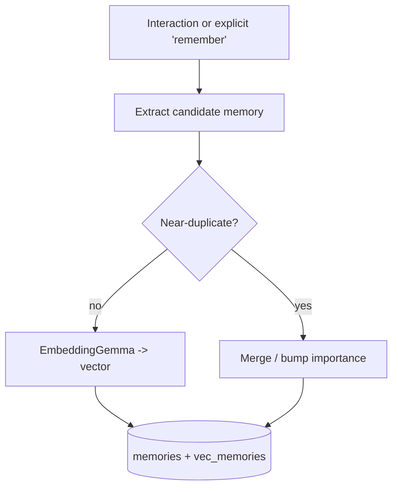
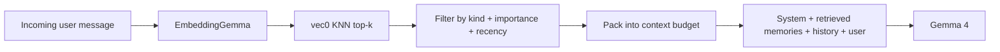

# Skinki — Long-Term Memory & RAG

> **SUPERSEDED (do not build from this document).** The memory architecture
> described below (SQLite + sqlite-vec inside the macOS app) predates the
> Exocortex pivot. Memory is now owned by the headless Rust engine
> [`kortex`](../../../kortex/) — see the top-level
> [`ARCHITECTURE.md`](../../../ARCHITECTURE.md) and
> [`ROADMAP.md`](../../../ROADMAP.md). The app consumes the engine via FFI at
> Stage 7. This file is kept only as historical context for the app wrapper.

Pillar 4: Skinki should *grow* with the user — remembering preferences, tone of voice, frequent filesystem paths, and coding style (reference: Vellum.ai-style evolving context). This document specifies the local memory architecture.

All memory is **local, private, and inspectable/erasable** by the user.

---

## 1. Goals

- Persist useful long-term facts and preferences across sessions.
- Retrieve the *right* context at the *right* time to augment prompts (RAG), without bloating the context window.
- Learn implicitly (from interactions) and explicitly (user says "remember that…").
- Be cheap: embeddings and search run locally and fast; storage is a single file.

## 2. Storage

- **Engine:** SQLite, one file at `~/Library/Application Support/Skinki/memory.sqlite`.
- **Vectors:** [`sqlite-vec`](https://github.com/asg017/sqlite-vec) virtual tables for on-disk approximate/exact nearest-neighbor search — no separate vector DB process.
- **Embeddings:** **EmbeddingGemma** via `MLXEmbedders` (same native MLX stack as inference; no Python). Vectors are L2-normalized for cosine similarity.
- **Encryption (later):** SQLCipher for at-rest encryption, key in the Keychain.

### Schema (initial)

```sql
-- Atomic, retrievable memories (facts, preferences, tone samples, paths, snippets)
CREATE TABLE memories (
  id          INTEGER PRIMARY KEY,
  kind        TEXT NOT NULL,        -- 'fact' | 'preference' | 'tone' | 'path' | 'code_style' | 'snippet'
  content     TEXT NOT NULL,        -- human-readable memory
  source      TEXT,                 -- where it came from (chat, text-engine, explicit)
  importance  REAL DEFAULT 0.5,     -- 0..1, drives decay/eviction
  created_at  INTEGER NOT NULL,
  last_used   INTEGER,
  use_count   INTEGER DEFAULT 0,
  metadata    TEXT                  -- JSON blob for extras
);

-- Raw interaction log (for summarization / consolidation jobs)
CREATE TABLE interactions (
  id          INTEGER PRIMARY KEY,
  role        TEXT NOT NULL,        -- 'user' | 'assistant' | 'system'
  content     TEXT NOT NULL,
  session_id  TEXT,
  created_at  INTEGER NOT NULL
);

-- Vector index over `memories.content`
CREATE VIRTUAL TABLE vec_memories USING vec0(
  memory_id   INTEGER PRIMARY KEY,
  embedding   FLOAT[768]            -- EmbeddingGemma dimension (confirm at impl time)
);
```

## 3. Write path (capture & consolidation)



- **Explicit:** the user (or the model via a tool) asserts a memory → stored with high importance.
- **Implicit:** a lightweight background pass summarizes recent `interactions` into candidate memories (preferences, recurring topics, tone samples). Runs on idle to respect Pillar 3.
- **Dedup:** before insert, embed and search; if a very similar memory exists, merge and bump `importance`/`use_count` instead of duplicating.

## 4. Read path (retrieval-augmented generation)



- Embed the incoming message; KNN over `vec_memories` for top-k candidates.
- Re-rank with a simple score: `cosine * w1 + importance * w2 + recency * w3`.
- Pack the highest-scoring memories into a bounded "memory" section of the system prompt, respecting a strict token budget (we never blow the context window).
- Always-included "pinned" preferences (e.g. preferred language, tone) bypass KNN.

## 5. Decay & eviction

- `importance` decays slowly over time unless reinforced by use (`last_used`, `use_count`).
- A periodic maintenance job evicts the lowest-scoring memories past a soft cap, keeping the store small and relevant.

## 6. Privacy & control

- A **Memory** panel in Settings: browse, search, edit, pin, and delete memories; "forget everything"; export/import.
- Nothing leaves the device. Embeddings and search are fully local.
- Optional at-rest encryption (SQLCipher) with a Keychain-stored key.

## 7. API surface (`MemoryStore` package)

```swift
public protocol MemoryStoring: Sendable {
    func remember(_ memory: NewMemory) async throws
    func retrieve(for query: String, limit: Int) async throws -> [RetrievedMemory]
    func pinned() async throws -> [Memory]
    func forget(id: Memory.ID) async throws
    func forgetAll() async throws
}
```

The embedding function is injected (`EmbeddingService` from `SkinkiCore`, implemented by `InferenceEngine`) so `MemoryStore` has no direct dependency on the inference backend.

## 8. MVP scope

For the 4-week MVP, `MemoryStore` ships as a working skeleton with the schema and API in place. The full capture→consolidation→retrieval loop is a Week-4 stretch / early Phase-2 item (see [`ROADMAP.md`](../ROADMAP.md)).
